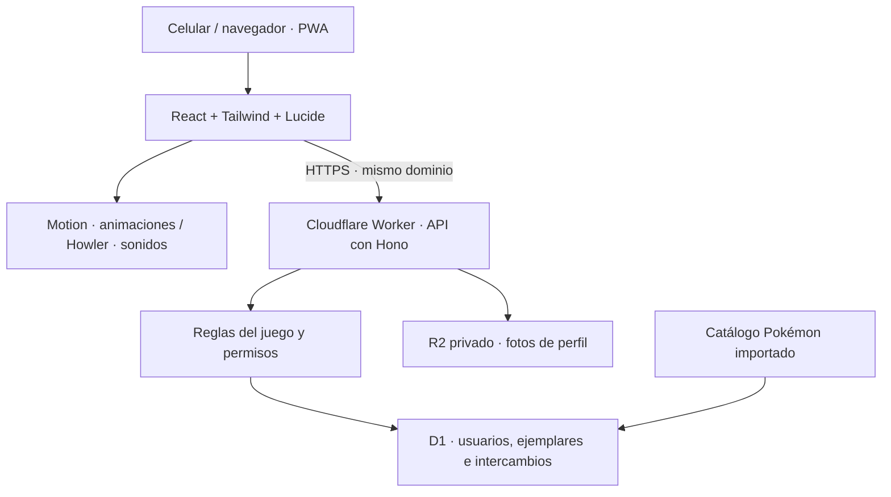

# Arquitectura de PokéSwap Classroom

**Autor:** [Christian Arevalo Jesus](https://github.com/carevalojesus).

**Estado:** arquitectura acordada para el MVP el 11 de septiembre de 2026. La base React/Vite/TypeScript y el Worker Hono están implementados en la issue #1; el esquema D1, sus migraciones y pruebas de integridad se incorporan en #2. Las funciones del juego y R2 siguen pendientes. Consultar el [README](README.md#documentación-y-ejecución) para comandos y alcance actual.

El [README](README.md) define las reglas del producto, perfiles, probabilidades y contratos previstos. Este documento establece cómo implementarlos y cómo añadir una experiencia visual y sonora coherente. Las bibliotecas de la base están fijadas en `package.json` y `package-lock.json`. Las restantes se incorporarán al implementar sus respectivas issues; figurar en esta arquitectura no implica estar instaladas.

## Objetivo y decisiones principales

Construir una PWA educativa para celulares, con colección persistente, recompensas del docente e intercambios seguros. La prioridad es que las operaciones sean correctas ante reintentos, pérdida de conexión y solicitudes simultáneas, junto con una interfaz clara y con personalidad de juego.

Se adopta un **monolito modular**: un repositorio, un despliegue y módulos separados para interfaz, API y reglas del juego. Un Cloudflare Worker sirve los archivos estáticos y las rutas `/api` bajo el mismo dominio, simplificando cookies y comunicación. El MVP corresponde a una sola clase.

La interfaz será una SPA con React y Vite. Las pantallas principales son privadas e interactivas; no se requiere renderizado en servidor para el alcance inicial. Cloudflare documenta la integración de React, Vite y Workers mediante su plugin de Vite. [Referencia oficial](https://developers.cloudflare.com/workers/framework-guides/web-apps/react/)



## Interfaz y estado

| Área | Tecnología | Responsabilidad y criterio |
|---|---|---|
| Aplicación | React + TypeScript + Vite | Componentes reutilizables y contratos tipados entre pantallas y API. |
| Estilos | Tailwind CSS | Diseño móvil, colores, espacios, tipografía y estados consistentes. |
| Iconos | Lucide React | Navegación, cámara, perfil, intercambio y estados; los gráficos Pokémon son recursos independientes. |
| Componentes básicos | shadcn/ui | Base adaptable para formularios, diálogos, pestañas y confirmaciones. |
| Navegación | React Router | Rutas de colección, Pokédex, perfil, intercambios y administración. |
| Datos del servidor | TanStack Query | Consultas, caché, carga, errores y actualización después de mutaciones. |
| Formularios | React Hook Form + Zod | Registro y edición del perfil con mensajes claros y esquemas de validación compartidos. |

Tailwind ofrece integración directa con Vite; Lucide expone componentes React; shadcn/ui permite adaptar el código de los componentes al diseño del proyecto. [Tailwind](https://tailwindcss.com/docs/installation/using-vite), [Lucide](https://lucide.dev/guide/react), [shadcn/ui](https://ui.shadcn.com/docs)

React Router organiza las pantallas. TanStack Query administra los datos recuperados de la API; filtros, selecciones y modales usan estado local de React. No se añade otro gestor global de estado al inicio. La caché del navegador no sustituye a D1 como fuente de verdad. Al cerrar sesión se descartan los datos privados en memoria para que otra cuenta no vea la colección anterior. [React Router](https://reactrouter.com/start/declarative/routing), [TanStack Query](https://tanstack.com/query/latest/docs/framework/react/overview)

Zod permitirá compartir esquemas de formato entre cliente y servidor. El servidor siempre vuelve a validar datos, sesión, permisos y reglas del juego; la validación del formulario solo mejora la experiencia. [Zod y su integración con formularios](https://zod.dev/)

### Dirección visual

La interfaz evocará una **Pokédex moderna**, con tarjetas protagonistas, cantidades de duplicados visibles y navegación inferior en móvil. La tipografía decorativa se reserva para títulos o celebraciones; formularios, cantidades y mensajes usan una tipografía fácil de leer.

Los componentes básicos se adaptarán a esta identidad. Los estados de error, éxito y reserva deberán ser comprensibles mediante texto e iconos, además del color. Los controles tendrán etiquetas, foco visible y manejo de teclado. Los diálogos se revisarán después de personalizarlos.

## Animaciones

**Motion para React** será la herramienta principal para entradas, salidas, gestos y secuencias de tarjetas. Las transiciones simples de color o foco se resolverán con CSS. [Motion](https://motion.dev/docs/react)

| Momento | Comportamiento previsto | Condición |
|---|---|---|
| Recibir el inicial | Apertura breve y revelado de la tarjeta. | Después de confirmar el premio en el servidor. |
| Canjear un PokéDrop | Revelado de los tres ejemplares. | Secuencia que se puede saltar; resultados ya persistidos. |
| Obtener un duplicado | Incremento visual, por ejemplo de `×4` a `×5`. | Refleja la cantidad confirmada. |
| Completar intercambio | Transición de las dos tarjetas y confirmación. | Después de la aceptación confirmada por la API. |
| Obtener Mew o Mewtwo | Efecto distintivo con la misma importancia visual. | Mantiene las probabilidades y reglas del README. |
| Botones y paneles | Transiciones cortas. | Respuesta inmediata al tocar. |

El acabado inicial se concentra en revelado, duplicados e intercambio. No se añaden más motores de animación al MVP.

Se respeta la preferencia de movimiento reducido del dispositivo, sustituyendo secuencias intensas por cambios sencillos. [Movimiento reducido en Motion](https://motion.dev/docs/react-use-reduced-motion)

La animación nunca decide ni confirma una operación. Saltarla, cerrarla o recargar no puede perder ni duplicar premios. Un resultado se persiste primero y luego se presenta. Si se pierde la respuesta, la interfaz recupera el estado de la operación antes de mostrar éxito.

## Sonidos

**Howler.js** gestionará efectos, volumen y reproducción mediante un controlador central. Los navegadores móviles pueden exigir una interacción del usuario para habilitar audio; la aplicación debe funcionar aunque el audio no llegue a desbloquearse. [Howler.js](https://github.com/goldfire/howler.js)

Efectos previstos:

- Pokémon recibido.
- Nueva especie añadida a la Pokédex.
- Duplicado acumulado.
- Intercambio completado.
- Aparición de Mew o Mewtwo.
- Operación rechazada, con un efecto discreto.

El sonido comienza **desactivado**, con un control visible para activarlo y ajustar el volumen. La preferencia se recuerda en ese dispositivo; no se promete sincronización entre dispositivos. La música de fondo queda fuera de la primera entrega. Se usarán efectos originales y breves con estética de videojuego.

El controlador evita sonidos superpuestos innecesarios y asocia cada celebración con el identificador de la operación confirmada. El sondeo, una nueva renderización o recuperar datos no deben reproducir automáticamente el mismo premio. Cuando un evento representa a la vez un premio y una especie nueva o especial, el controlador elige una secuencia coherente. El resultado siempre se comunica también visualmente.

## QR, fotos y PWA

| Necesidad | Herramienta | Uso |
|---|---|---|
| Mostrar QR | qrcode.react | QR del docente y de ofertas de intercambio. |
| Leer QR | qr-scanner | Cámara bajo demanda, apagada al salir del escáner. |
| Recortar fotos | react-easy-crop | Recorte cuadrado; exportación posterior con Canvas. |
| Instalación y recursos estáticos | vite-plugin-pwa | Manifest y service worker para la aplicación. |

Referencias de las herramientas: [qrcode.react](https://github.com/zpao/qrcode.react), [qr-scanner](https://github.com/nimiq/qr-scanner), [react-easy-crop](https://github.com/ValentinH/react-easy-crop), [Vite PWA](https://vite-pwa-org.netlify.app/guide/).

### QR

El QR contiene un enlace con token temporal. El servidor determina su tipo de operación y verifica permisos, estado y vencimiento. Consultarlo no entrega ejemplares ni acepta intercambios. La interfaz requiere la acción correspondiente para confirmar.

Se ofrecerá abrir el enlace o introducir el código como alternativa a la cámara. El código resolverá la misma operación y tendrá las mismas validaciones y vigencia. Las rutas de resolución deberán limitar intentos; introducir un código no omite la autenticación.

Se conservan los tiempos del README: PokéDrop con 30 minutos por defecto, QR de intercambio con 60 segundos para presentar propuesta y propuesta con 120 segundos para aceptación. No se mezclan los dos plazos del intercambio.

### Fotos persistentes

El recorte del navegador mejora la experiencia; no demuestra que la imagen esté guardada ni reemplaza la validación del Worker. Se mantienen los límites del README: entrada JPEG, PNG o WebP de hasta 5 MiB y salida WebP de 512 × 512 de hasta 1 MiB.

La cuenta y el inicial se crean antes de cargar la foto. R2 guarda el archivo y D1 su referencia, versión y operación de carga. La API confirma éxito después de persistir la referencia. Las rutas autenticadas sirven fotos desde el bucket privado. [Acceso a R2 desde Workers](https://developers.cloudflare.com/r2/api/workers/workers-api-reference/)

D1 y R2 no comparten una transacción. Las cargas usan identificadores de operación y control de versión. Una tarea programada concilia cargas abandonadas y borrados pendientes, comprobando referencias y cargas activas antes de eliminar objetos. Fallar al subir o sustituir una foto conserva la cuenta y la última referencia válida.

### PWA y conectividad

El service worker almacena la estructura de la aplicación y recursos públicos. No guarda respuestas privadas de la API ni fotos autenticadas. Las fotos usan caché privada con revalidación según el README.

Las operaciones del juego requieren conexión; no se encolan canjes ni intercambios offline. La interfaz muestra cuando no puede confirmar el estado. Una actualización del service worker se pospone durante un intercambio activo para evitar recargas inesperadas.

## Backend y persistencia

| Capa | Tecnología | Responsabilidad |
|---|---|---|
| API | Hono en Cloudflare Workers | Rutas, validación de solicitudes, sesión y permisos. |
| Base de datos | Cloudflare D1 | Usuarios, catálogo, ejemplares, canjes, reservas e historial. |
| Acceso a datos | Drizzle ORM | Esquema tipado, migraciones y consultas habituales. |
| Archivos | R2 privado | Fotos persistentes con acceso a través del Worker. |
| Mantenimiento | Tareas programadas del Worker | Limpieza de archivos pendientes y operaciones vencidas. |

Hono documenta su uso con Workers y Drizzle su integración con D1. [Hono](https://hono.dev/docs/getting-started/cloudflare-workers), [Drizzle](https://orm.drizzle.team/docs/sqlite/connect-cloudflare-d1)

### Responsabilidades y estructura prevista

```text
src/
  client/
    app/
    components/
    features/
      auth/
      profile/
      collection/
      pokedex/
      drops/
      trades/
      ranking/
      admin/
    lib/
      api/
      audio/
  server/
    routes/
    services/
    db/
    jobs/
  shared/
    schemas/
    contracts/
migrations/
public/
  audio/
  images/
```

Las rutas reciben solicitudes y aplican controles de acceso. Los servicios ejecutan las reglas del juego y la capa de datos persiste resultados. Los módulos compartidos contienen contratos y validaciones, sin secretos ni código privado del servidor. Los componentes no deciden sorteos, propiedad ni permisos.

Las fotos privadas no se guardan en `public/`. Esta estructura describe la organización acordada. La base ya contiene `client/app`, `server/db`, `shared/contracts` y `migrations`; los módulos restantes se crearán al implementar sus issues.

### Integridad de operaciones

Cada ejemplar tiene identidad propia, propietario e historial. Se conserva la protección del primer ejemplar por especie y se reservan los duplicados involucrados en operaciones activas. El cliente nunca impone el Pokémon obtenido ni su propietario.

Registro, canjes y aceptación de intercambios deben ser atómicos y seguros ante reintentos. Se usarán restricciones únicas e identificadores de operación para recuperar el mismo resultado cuando la respuesta se pierda. Reintentar con la misma clave y datos incompatibles debe producir conflicto, no una segunda operación.

D1 ofrece `batch()` transaccional, pero una actualización de cero filas no constituye necesariamente un error SQL. La implementación debe hacer que la validación de propiedad, disponibilidad, protección, estado y vencimiento forme parte de la misma operación consistente que transfiere ambos ejemplares y guarda su historial. Un fallo de precondición debe impedir toda transferencia. No basta con comprobar datos antes del lote ni con verificar el resultado después de haber confirmado cambios. [D1 batch](https://developers.cloudflare.com/d1/worker-api/d1-database/)

Drizzle facilitará las consultas habituales; el SQL de aceptación requiere diseño y revisión específicos para D1 y pruebas simultáneas. No se presupone soporte de transacciones interactivas por usar un ORM.

Las tareas de limpieza no sustituyen la validación del vencimiento en cada solicitud. Las reservas vencidas deben dejar de bloquear ejemplares mediante una resolución consistente al operar, aunque la tarea programada todavía no haya pasado.

### Autenticación y privacidad

El ingreso usa ID SENATI y contraseña. La sesión se representa mediante un token aleatorio en cookie `HttpOnly`, `Secure` y `SameSite`, con hash, vencimiento y revocación en D1. Las mutaciones llevan protección CSRF y el servidor comprueba el rol y la propiedad del recurso en cada operación. La cuenta docente se provisiona fuera del registro público.

El módulo concreto de autenticación y el algoritmo de hash de contraseñas se seleccionarán y verificarán por su compatibilidad con Workers y el acceso mediante ID SENATI. No se almacenarán contraseñas en claro ni tokens de sesión en `localStorage`.

Los datos personales solo se exponen al propio alumno y al docente autorizado. Ranking e intercambios muestran alias y foto. Los errores y registros operativos deben permitir investigar fallos sin registrar contraseñas, tokens ni contenido privado innecesario.

### Actualización y capacidad

TanStack Query consulta cada tres segundos únicamente mientras una pantalla de intercambio está activa y visible. El sondeo termina al cerrar la pantalla o alcanzar un estado final. Colección y ranking se actualizan tras cambios y al volver a sus pantallas. La interfaz espera confirmación del servidor antes de presentar una transferencia como completada.

La ausencia de cupo global en la regla de PokéDrops no implica capacidad técnica ilimitada. Antes de la entrega se medirá el comportamiento con el número esperado de alumnos simultáneos. WebSockets y Durable Objects quedan fuera del MVP; no se presupone que sean necesarios para una sola clase.

### Catálogo y sorteos

La tarea #3 incorpora las 151 especies y sus ilustraciones locales; ver [catálogo y sorteos](docs/CATALOGO.md). Se importan durante mantenimiento para que una caída de PokéAPI no interrumpa registros ni sorteos. Las imágenes públicas se preparan como recursos de presentación; no intervienen en decisiones del juego.

El backend mantiene una función común de sorteo y una versión del balance. Mewtwo y Mew tienen 0,1 % cada uno por sorteo; las otras 149 especies comparten el 99,8 %. Se permiten repetidos. La meta y el ranking cuentan las especies #001–#150; Mew aparece como adicional. El detalle del algoritmo está en el README y no cambia por animaciones, sonidos ni preferencias del dispositivo.

## Pruebas y criterios técnicos de entrega

Se usarán **Vitest con la integración de Workers** para reglas y persistencia, y **Playwright** para el recorrido de un docente y dos alumnos. Las pruebas de D1 deben ejercitar la integración y las restricciones reales, además de las funciones aisladas. [Vitest en Workers](https://developers.cloudflare.com/workers/testing/vitest-integration/), [Playwright](https://playwright.dev/)

Los criterios funcionales del README se complementan con estas verificaciones:

- [ ] Un doble canje devuelve los mismos tres ejemplares y no crea otros.
- [ ] Dos aceptaciones simultáneas solo completan una transferencia de ambos ejemplares.
- [ ] Un ejemplar protegido o reservado no puede transferirse indebidamente.
- [ ] Vencimiento, cancelación y rechazo liberan reservas de forma consistente.
- [ ] Perder la respuesta permite recuperar el resultado sin repetir la operación.
- [ ] La foto persiste entre sesiones y un fallo entre R2 y D1 se puede conciliar.
- [ ] Movimiento reducido, salto de secuencias y recarga conservan el resultado del juego.
- [ ] El sonido empieza apagado y el sondeo no repite celebraciones.
- [ ] Cámara, permisos denegados, enlace/código alternativo y audio se prueban en teléfonos reales.
- [ ] El service worker no almacena datos privados ni interrumpe un intercambio por actualización.
- [ ] El flujo completo funciona por HTTPS y con la concurrencia prevista para la clase.

La validación automatizada se complementa con pruebas móviles de cámara y audio. Los sorteos se prueban con entradas controladas para cubrir Mew, Mewtwo y las demás especies sin depender de su aparición aleatoria.

## Fases de entrega

1. **Base funcional:** crear proyecto, despliegue mínimo, D1, R2, migraciones y catálogo; implementar registro, alias persistente, sesión e inicial.
2. **Juego completo:** perfil y fotos con limpieza, colección, Pokédex, PokéDrops, intercambios, ranking y administración. Verificar persistencia y concurrencia durante esta fase.
3. **Acabado y entrega:** completar revelado, duplicados e intercambio con Motion, efectos opcionales con Howler, PWA y revisión móvil. Validar el recorrido de docente y alumnos.

El alcance completo es exigente para una jornada. La integridad del juego y la persistencia son condiciones de entrega; el acabado puede simplificarse. Los mayores puntos de validación son los intercambios concurrentes y la coordinación de fotos entre R2 y D1.

## Decisiones pendientes de implementación

- Incorporar las dependencias de las funciones restantes. Las issues #1 y #2 fijan la base, Drizzle, el esquema D1 y los comandos de migración; ver [modelo de datos](docs/DATOS.md).
- Elegir y verificar el módulo de autenticación y el hash de contraseñas en Workers.
- Implementar la aceptación completa de intercambios sobre el esquema de reservas y el patrón de aserciones D1 probado en #2. Las pruebas de almacenamiento no sustituyen la validación del servicio de #14.
- Seleccionar y verificar la validación del contenido WebP en el Worker.
- Medir capacidad para la clase y comprobar cámara, audio y PWA en los dispositivos previstos.

Estas verificaciones completan las decisiones de implementación sin alterar el stack acordado. No se declara ninguna función implementada hasta contar con código y validación. Los comandos ejecutables existentes se documentan en el README; los pendientes se añadirán cuando se implementen.
